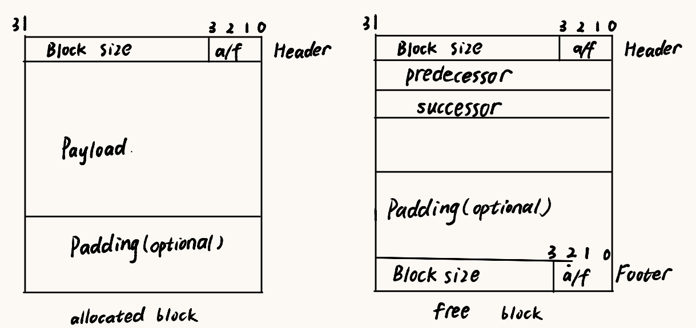
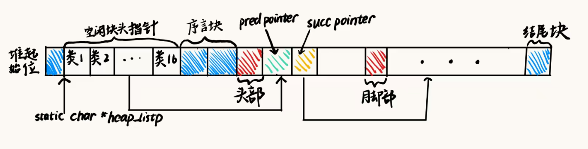
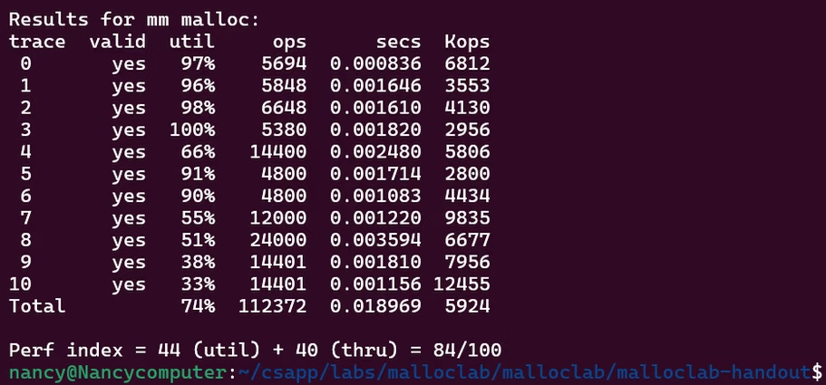
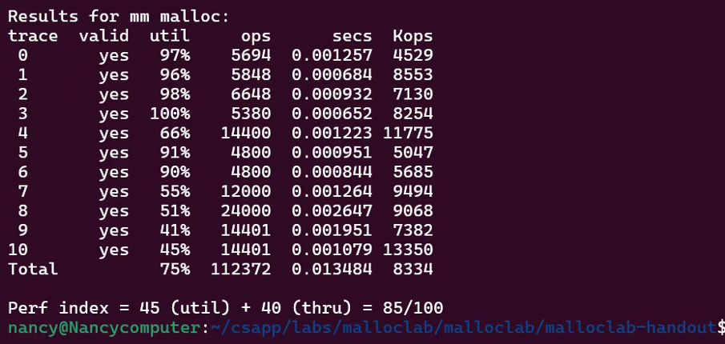
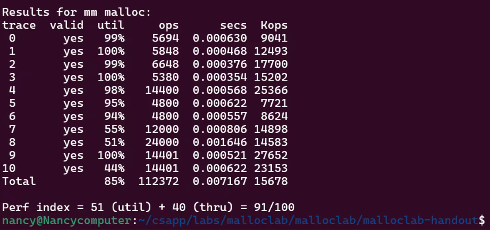

# 动态内存管理器实现

## 实验概览

Malloc lab要求用C语言编写一个动态内存分配器，即实现malloc,free,realloc功能

该项目的两个衡量指标分别是空间利用率（峰值时被分配的区域大小与堆总大小的比值）和吞吐率（每单位时间完成的最大请求数），力求达到两者的平衡

## 设计架构

动态内存分配器维护着一个进程的虚拟内存区域，即堆。分配器将堆视为一组大小不同的块的集合来维护，且这些块在地址上是连续的。

* 1.关于块的组织方式，本项目采用的是分离显式空闲链表的方式来管理空闲内存块。选择将不同大小范围的空闲块存放在各自的空闲链表中。本项目选择将空闲链表划分为16组，即16-31,32-63…… 2^19-无穷。
* 2.关于块的结构设计，内存块的结构如下：

如上图，对于未分配块，结构分为头，尾，前一个空闲块位置，后一个空闲块位置。由于块是八字节对齐的，头部和尾部所放置的块的大小后三位可以用来记录其他的信息。在本项目中我选择用最后一位来记录本块是否分配，用倒数第二位来记录前一块是否分配。
同时，我考虑到当程序在操作很多小块的时候，如果每个块都保留一个头部和脚部，会产生显著的内存开销。回想原理，我们之所以设计脚部，是因为我们在合并空闲块的时候，可能需要判断前一块是否是空闲的。但如果前一块不空闲的话，我们并不需要知道前一块的大小。所以我选择对这一点进行优化，即对于已分配块去除脚部。但是我们仍需要知道前一块是否已分配，所以我们选择使用每一块头部的倒数第二位来记录。

* 3.关于堆的结构设计：容易注意到，每个空闲块中都记录了前继块和后继块的位置，因此我们实际上是用16组双向链表来维护空闲块。同时，由于项目要求不能使用全局数组这样的结构，所以我们需要在堆上预留一块位置来放置每个链表的头节点位置。
并且，由于我们整个结构都是在堆上组织的，我们需要给我们的可分配区域做一个界限，因此我们设立了序言块和结尾块来作为分界线，结构如下图

* 4.关于分配策略，本项目考虑过的策略有首次适配和最佳适配，最终采用的方式是最佳适配法。

* 5.关于合并机制：本项目选择在free操作之后立即以O(1)时间复杂度合并相邻空闲块。
## 具体代码实现

### 1. 根据上述思路，我定义了一些宏方便操作
```c
/*8字节对齐*/
#define ALIGNMENT 8
#define WSIZE 4
#define DSIZE 8
#define CHUNKSIZE (1 << 6)
/*找到最接近size且是8的倍数的数字*/
#define ALIGN(size) (((size) + (ALIGNMENT-1)) & ~0x7)
//就是8
#define SIZE_T_SIZE (ALIGN(sizeof(size_t)))
//合并size和alloc信息
#define PACK(size,alloc) ((size) | (alloc))
//在p处读一个word
#define GET(p) (*(unsigned int *) (p))
//在p处放置一个word
#define PUT(p, val) (*(unsigned int *)(p) = (unsigned int)(val))
//从头部得到size信息
#define GET_SIZE(p) (GET(p) & ~0x7)
//得到当前块分配信息
#define GET_ALLOC(p) (GET(p) & 0x1)
//得到前一块的分配信息
#define GET_PRE_ALLOC(p) ((GET(p) >> 1) & 0x1) //这样输出的是0或1
//已知bp位置，算出头部位置
#define HDRP(bp) ((char*)(bp) - WSIZE)
//已知bp位置，算出脚部位置（这应该是对于空闲块）
#define FTRP(bp) ((char*)(bp) + GET_SIZE(HDRP(bp)) - DSIZE)
//已知bp,算出放prev指针的位置
#define PREV_FREE(bp) ((char*)(bp))
//已知bp,算出放next指针的位置
#define NEXT_FREE(bp) ((char*)(bp) + WSIZE)
//已知当前bp，跳到下一块的bp处
#define NEXT_BLKP(bp) ((char *)(bp) + GET_SIZE(((char*)(bp) - WSIZE)))
//跳到前一块bp处(当然，也是针对有脚部的情况)
#define PREV_BLKP(bp) ((char *)(bp) - GET_SIZE(((char*)(bp) - DSIZE)))
//分离链表数组大小
#define LIST_COUNT 16
```

### 2.然后对堆进行初始化
```c
int mm_init(void)
{
    size_t init_size = (LIST_COUNT + 4)* WSIZE;
    char *p = mem_sbrk(init_size);
    if (p == (void *)-1) return -1;
    //初始化链表数组
    for (int i = 0; i < LIST_COUNT; i++) {
        PUT(p + WSIZE+(i*WSIZE),(unsigned int)NULL);//因为第一个是填充位
    }
    free_list_start = p + WSIZE;
    char *prologue_base = p + WSIZE + LIST_COUNT * WSIZE;//序言块的起始位
    PUT(p , 0);
    PUT(prologue_base, PACK(DSIZE, 3));      
    PUT(prologue_base + WSIZE, PACK(DSIZE, 3));  
    //之所以把结尾块的pre_alloc位记为1，是因为序言块一定是已分配的，
    //结尾块后面虽然没有内容，但是他也是需要承担一个普通头部的功能，即正确记录前块是否分配
    PUT(prologue_base + (2 * WSIZE), PACK(0, 3)); 
    heap_listp = prologue_base + WSIZE;
    if (extend_heap(CHUNKSIZE / WSIZE) == NULL) return -1;
    return 0;
}
```
### 3.然后要注意扩展堆，每次是在堆的尾部申请空间
```c
static void *extend_heap(size_t words) {
    char *bp;
    size_t size;

    /* 向上舍入到双字对齐 */
    size = (words % 2) ? (words + 1) * WSIZE : words * WSIZE;
    if (size < 16) size = 16;
    if ((long)(bp = mem_sbrk(size)) == -1)
        return NULL;
    //注意，bp此时指向的是旧结尾块的末尾处，得到了旧的最后一块的分配信息
    int is_old_last_alloc = GET_PRE_ALLOC(HDRP(bp));
    PUT(HDRP(bp), PACK(size, is_old_last_alloc << 1));         /* 新空闲块 Header */
    PUT(FTRP(bp), PACK(size, is_old_last_alloc << 1));         /* 新空闲块 Footer */
    PUT(HDRP(NEXT_BLKP(bp)), PACK(0, 1)); /* 新的结尾块 Epilogue */
    add_to_list(size,bp);
    if(!is_old_last_alloc) { //如果原来的最后一块为空
        char* old_bp = bp;
        size_t old_size = size;
        char* old_pre_bp = PREV_BLKP(bp);
        size_t old_pre_size = GET_SIZE(HDRP(PREV_BLKP(bp)));
        size += old_pre_size ;
        //合并后的头部，当前块分配信息为0
        //pre_alloc为1
        PUT(HDRP(PREV_BLKP(bp)),PACK(size,2));
        //脚部同理
        PUT(FTRP(bp),PACK(size,2));
        bp = PREV_BLKP(bp);
        remove_from_list(old_size,old_bp);//移除旧块
        remove_from_list(old_pre_size,old_pre_bp); //移除旧的前块
        add_to_list(size,bp);//添加新的合并块
    }
    return bp; 
}
```
### 4.维护链表的函数

```c
//给一个size,返回应该去哪个组寻找
int find_group(size_t size) {//这里我实际上默认size是大于等于16且8字节对齐的
    //16到31是第0组
    int size1 = size >> 4;
    int index = 0;
    while(size1 > 1 && index < LIST_COUNT - 1) {
        size1 = size1 >> 1;
        index += 1;
    }
    return index;
}
char *find_list_head(int index){ //找到链表头中储存的地址
    return (char *)GET(free_list_start + index * WSIZE);
}
```
有了上面两个辅助函数，我们就可以写加入链表和从链表移除的函数了，其中加入链表的复杂度为O(1),从链表移除的复杂度为O(n)

```c
void add_to_list(size_t size, char* bp) { //把大小为size,位置为bp的块加入空闲链表
    int index = find_group(size);
    char* old_head = find_list_head(index);
    PUT(NEXT_FREE(bp) , old_head);
    PUT(PREV_FREE(bp) , (unsigned int)NULL);
    if(old_head != NULL){//只有在原先头部存在的时候，才需要更新原先头部的prev指针
        PUT(PREV_FREE(old_head) , bp);
    }
    //把bp变成新的头部
    PUT(free_list_start + index * WSIZE, (unsigned int)bp);
}

void remove_from_list(size_t size, char* bp) { //把大小为size,位置为bp的块从空闲链表删除
    int index = find_group(size);
    char* prev = (char *)GET(PREV_FREE(bp)); //前一个链表的位置
    char* next = (char *)GET(NEXT_FREE(bp)); //后一个链表的位置
    if(prev == NULL) {
        PUT(free_list_start + index * WSIZE, (unsigned int)next);
        //PUT(PREV_FREE(next),(unsigned int)NULL);//现在next变成了新的链表头
        //删掉是因为next不一定有，这里的逻辑到后面if next != null一起处理了
    } else{
        PUT(NEXT_FREE(prev), (unsigned int)next);
    }
    if(next != NULL) { //next不是空，则更新其prev
        PUT(PREV_FREE(next), (unsigned int)prev);
    }
}
```
### 5.合并空闲块函数：

在free或者extend_heap的时候，我们需要根据前后块的空闲情况来执行合并操作。这里的操作是根据空闲块在堆中的位置来合并的，与链表排列无关，但是也注意要随着更新空闲链表。
```c
static char *coalesce(char* bp) { //在free或者extend的情况下使用，合并空闲块
    //在这个函数中，我们要实现把块从链表删除/从链表插入块的操作
    //为了优化性能，选择在合并之前先不把原本块加入链表
    size_t size = GET_SIZE(HDRP(bp));//当前块尺寸
    int pre_alloc = GET_PRE_ALLOC(HDRP(bp));
    int next_alloc = GET_ALLOC(HDRP(NEXT_BLKP(bp)));
    if (pre_alloc && next_alloc) {
        add_to_list(size,bp);
        return bp;
    }
    else if (!pre_alloc && next_alloc) {
        char* old_pre_bp = PREV_BLKP(bp);
        size_t old_pre_size = GET_SIZE(HDRP(PREV_BLKP(bp)));
        size += old_pre_size ;
        //合并后的头部，当前块分配信息为0
        //记得合并后那一块的pre_alloc信息是1
        //因为如果原先的pre块未分配，那么pre的pre一定是已分配
        PUT(HDRP(PREV_BLKP(bp)),PACK(size,2));
        //脚部同理
        PUT(FTRP(bp),PACK(size,2));
        bp = PREV_BLKP(bp);
        //remove_from_list(old_size,old_bp);//移除旧块
        remove_from_list(old_pre_size,old_pre_bp); //移除旧的前块
        add_to_list(size,bp);//添加新的合并块
        return bp;
    }
    else if (pre_alloc && !next_alloc) {
        char* old_next_bp = NEXT_BLKP(bp);
        size_t old_next_size = GET_SIZE(HDRP(NEXT_BLKP(bp)));
        size += old_next_size;
        int pre_alloc = GET_PRE_ALLOC(HDRP(bp));//得到当前块的pre_alloc信息
        PUT(HDRP(bp),PACK(size,pre_alloc*2));//合并后的头部，当前块分配信息为0，但记得要继承原先当前块的pre_alloc信息
        //因为已经更新了头部size信息，所以可以直接用FTRP找到脚部
        PUT(FTRP(bp),PACK(size,pre_alloc*2));
        //remove_from_list(old_size,old_bp);//移除旧块
        remove_from_list(old_next_size,old_next_bp);//移除旧的next块
        add_to_list(size,bp);//添加新的合并块
        return bp;
    }
    else {
        char* old_pre_bp = PREV_BLKP(bp);
        size_t old_pre_size = GET_SIZE(HDRP(PREV_BLKP(bp)));
        char* old_next_bp = NEXT_BLKP(bp);
        size_t old_next_size = GET_SIZE(HDRP(NEXT_BLKP(bp)));
        size += old_pre_size+old_next_size;
        int pre_pre_alloc = GET_PRE_ALLOC(HDRP(PREV_BLKP(bp)));
        //更新新的头部，脚部的信息
        PUT(HDRP(PREV_BLKP(bp)),PACK(size,pre_pre_alloc*2));
        PUT(FTRP(NEXT_BLKP(bp)),PACK(size,pre_pre_alloc*2));
        bp = PREV_BLKP(bp);
        //remove_from_list(old_size,old_bp);//移除旧块
        remove_from_list(old_pre_size,old_pre_bp); //移除旧的前块
        remove_from_list(old_next_size,old_next_bp);//移除旧的next块
        add_to_list(size,bp);//添加新的合并块
        return bp;
    }

}
```
### 6.分配函数(malloc):

分配一个大小为size的空间，并返回一个指向bp的指针
首先需要在空闲块中寻找合适的可以用作分配的块，
如果能找到一个块，则分配完之后还需要考虑有没有碎片，
这里要注意，如果碎片大于等于4word,我们把他正常分割，加入对应的空闲块链表，
但是如果小于4word,那么我们就不分割了，直接把这一小块加到malloc的空间里面去（实际上也最多浪费2word）
如果空闲链表中没有合适的块，则extend，extend之后记得要先合并，然后再执行分配函数
```c

void *mm_malloc(size_t size)
{
    //CHECKHEAP(1);
    int realsize = ALIGN(size + 4); //加上了头部
    if (realsize < 16) {
        realsize = 16; //如果算出来需要分配的空间小于16，则取16
    }
    char* bp = find_available_block(realsize);
    if(bp != NULL) { //如果找到了合适的块
    int free_block_size = GET_SIZE(HDRP(bp)); //供分配空闲块大小
    size_t remain_size = free_block_size - realsize;
    if (remain_size < 16) { //分出来碎片小于16,则不分碎片
        PUT(HDRP(bp), PACK(free_block_size,3));
        //PUT(FTRP(bp), PACK(free_block_size,1));
        //更新下一块block记录前一块是否分配的位
        char* next_head = HDRP(NEXT_BLKP(bp));
        PUT(next_head,PACK(GET(next_head),0x2));
        // if (!GET_ALLOC(next_head)) { //如果下一块是空的，那么还要更新尾部信息
        //     PUT(FTRP(bp),GET(next_head));
        // }
        //删掉是因为找到的这块bp原来分配前就是空的，那么他的下一块不可能为空
        remove_from_list(free_block_size,bp);//从freelist里面删掉这一块
        //CHECKHEAP(1);
        return bp;
    }
    else { //需要分出来一块碎片
        char* next_foot = FTRP(bp); //这是修改前的块的脚部位置，也是分割后的空闲块的脚部位置
        //这里不需要继承原来块的pre_alloc信息是因为原来块是空，则原来块的pre_alloc一定是1
        PUT(HDRP(bp), PACK(realsize,3));
        remove_from_list(free_block_size,bp);//从freelist里面删掉原本这一块
        size_t fragment_size = remain_size ;
        char* next_head = HDRP(NEXT_BLKP(bp));
        PUT(next_head,PACK(remain_size,2));//当前块未分配，前一块已分配
        PUT(next_foot,PACK(remain_size,2));
        char* next_bp = NEXT_BLKP(bp); //空闲块的bp
        add_to_list(fragment_size,next_bp);//把碎片加入链表
        //CHECKHEAP(1);
        return bp;
    }
    }
    else //接下来考虑在空闲块链表中没有找到合适的free块的情况
    {
        if (extend_heap(realsize / WSIZE) == NULL)
        {
            return NULL;
        }
        //CHECKHEAP(1);
        return mm_malloc(size);
    }
}
```
### 7.寻找合适空闲块:

在空闲链表中寻找满足大小的空闲块并将其分配给用户，如当前链表中无满足大小的空闲块时，则在更大的空闲链表中寻找。在空闲链表中的寻找方式又可以分为两种：
* 首次适配法：当寻找到第一个满足大小的空闲块时，立即返回该空闲块。
* 最佳适配法：遍历整个空闲链表，寻找满足大小的最小空闲块。
```c
//首次适配法
char* find_available_block_first(size_t size) {
    int index = find_group(size);
    char *list_head = find_list_head(index);
    //顺着头一个个往下找，如果该链表找不到，则到下一个更大的链表组寻找，但是注意链表组只有16个
    while(index < 16) { //最多只有16组
        char* bp = list_head;
        while(bp != NULL) {
            if(GET_SIZE(HDRP(bp)) >= size) { //首次适配法，找到了合适的块
                return bp;
            }
            bp = (char *)GET(NEXT_FREE(bp));//next指针指向的地方
        }
        index+= 1;
        list_head = find_list_head(index);//找下一个链表组
    }
    return NULL;//如果都没找到，就从这里退出了
}
//最佳适配法
char* find_available_block(size_t size) {
    int index = find_group(size);
    char *best_bp = NULL; 
    size_t min_size = 0xffffffff;
    while(index < 16) {
        char *bp = find_list_head(index); 
        
        while(bp != NULL) {
            size_t currentsize = GET_SIZE(HDRP(bp));
            if (currentsize >= size) {
                if (currentsize == size) return bp; 
                if (currentsize < min_size) {
                    best_bp = bp;
                    min_size = currentsize;
                }
            }
            bp = (char *)GET(NEXT_FREE(bp));
        }
        if (best_bp != NULL) {
            return best_bp;
        }
        index++; 
    }
    return NULL;
}
```
### 8.内存块的重分配(realloc)：

这是本实验的难点，如果我们仅用mm_malloc和mm_free来实现本功能，得到的内存使用性能会比较低,因此我们选择重新写该函数的逻辑。
* 首先对于输入参数的特殊性进行判断，当ptr为空或size为0时，调用mm_malloc或mm_free函数。

* 当原内存块大小大于等于重分配所需大小，则直接原内存块返回，如果两者相差大于16，我们选择分割碎片。
```c
    size_t new_size = ALIGN(size + WSIZE);
    size_t old_size = GET_SIZE(HDRP(ptr));
    if (new_size < 16) {
        new_size = 16;
    }
    int fragment = old_size - new_size;
    if (fragment >= 0) { //新size小于等于原size
        if (fragment < 16) { //碎片过小，不分割
            return ptr;
        } 
        else { //新size小于原size且分割碎片
            int pre_alloc = GET_PRE_ALLOC(HDRP(ptr));
            int next_alloc = GET_ALLOC(HDRP(NEXT_BLKP(ptr)));
            //更新新块的头部信息，size为new_size,alloc为1，pre_alloc为原信息
            PUT(HDRP(ptr),PACK(new_size,1+2*pre_alloc));
            //更新新碎片的头部信息，alloc为0，pre_alloc为1，size为fragment
            PUT(HDRP(NEXT_BLKP(ptr)),PACK(fragment,2));
            PUT(FTRP(NEXT_BLKP(ptr)),PACK(fragment,2));
            //记得存在一种原来块的后一块为空，那么新的碎片和原来空的next块可以合并的情况
            if (next_alloc == 0) {
                coalesce(NEXT_BLKP(ptr));
                return ptr;
            }
            add_to_list(fragment,NEXT_BLKP(ptr));
            //记得还要更新碎片的next块的pre_alloc信息
            char *next_next_block = NEXT_BLKP(NEXT_BLKP(ptr));
            //把next_next块的pre_alloc信息改成0
            PUT(HDRP(next_next_block), GET(HDRP(next_next_block)) & ~0x2);
            return ptr;
        }

    }
```
* 如果原内存块大小小于需要分配的大小，我们先尝试将其与紧邻的下一块合并，看是否能凑出新的size所需要的大小
注意在这里我们同样考虑到要分割碎片的情况以及紧邻的下一块是堆尾部块的特殊情况
```c
        //新size大于原size
        int is_next_free = GET_ALLOC(HDRP(NEXT_BLKP(ptr)));
        int is_prev_free = GET_PRE_ALLOC(HDRP(ptr));
        if (is_next_free == 0) { //下一块为空
            size_t next_size = GET_SIZE(HDRP(NEXT_BLKP(ptr)));
            size_t add_size = old_size + next_size;
            int fragment1 = add_size - new_size; //两块加在一起的大小与新size之差
            if (fragment1 >= 0) {
                if (fragment1 < 16) { //相当于直接把后面那块空闲的合并到这个malloc块中
                int pre_alloc = GET_PRE_ALLOC(HDRP(ptr));
                char* old_next = NEXT_BLKP(ptr);
                //把空的next块从空闲链表删除
                remove_from_list(next_size,old_next);
                //更改新块的头部信息
                PUT(HDRP(ptr),PACK(add_size,1+2*pre_alloc));
                //还要更改原next空闲块后一块的pre_alloc信息
                //新块的next块的pre_alloc为1
                PUT(HDRP(NEXT_BLKP(ptr)),GET(HDRP(NEXT_BLKP(ptr))) | 0x2);
                return ptr;
            } else { //两块加在一起与所需size之差大于16，说明还可以分出一块碎片
                int pre_alloc = GET_PRE_ALLOC(HDRP(ptr));
                char* old_next = NEXT_BLKP(ptr);
                //把空的next块从空闲链表删除
                remove_from_list(next_size,old_next);
                PUT(HDRP(ptr),PACK(new_size,1+2*pre_alloc));
                //更新新的碎片块的头部信息，大小为fragment1,alloc为0，pre_alloc为1
                PUT(HDRP(NEXT_BLKP(ptr)),PACK(fragment1,2));
                //尾部同理
                PUT(FTRP(NEXT_BLKP(ptr)),PACK(fragment1,2));
                //把新的碎片块加到空闲链表
                add_to_list(fragment1,NEXT_BLKP(ptr));
                return ptr;
                }
            } else { //虽然下一块为空，但加起来空间不够
                //注意，这里还存在一种可能，即Next块的空间虽然不够，但是已经是堆的最后一块了
                if (GET_SIZE(HDRP(NEXT_BLKP(NEXT_BLKP(ptr)))) == 0) { //当前块的下一块是堆的最后一块
                    size_t needed_space = (new_size - add_size)*2;
                    extend_heap(needed_space /WSIZE);
                    return mm_realloc(ptr,size);
                }
                char* new_ptr = mm_malloc(size);
                memcpy(new_ptr , ptr , old_size - WSIZE);//把原来的内容复制过去
                mm_free(ptr);
                return new_ptr;
            }
            
        }
```

* 出于优化的目的，我们除了考虑向后合并，还考虑向前合并。
但是这里要特别注意的是。向前合并我们同样需要挪动内容，并且很多时候，内容的目标区域和原区域可能会有重叠，因而我们必须使用memmove函数
并且有一个很容易错的点在于，在向前合并能提供充足位置的情况下，我们必须先把前空闲块从空闲链表删除，再复制内容，因为先复制内容会导致前空闲块的prev,next指针被覆盖，从而导致无法从链表删除该空闲块的情况
```c
        else if (is_prev_free == 0) {
            size_t prev_size = GET_SIZE(HDRP(PREV_BLKP(ptr)));
            size_t add_size = old_size + prev_size;
            int fragment2 = add_size - new_size;
            if (fragment2 >= 0) {
                char* old_ptr = ptr;
                char* new_ptr = PREV_BLKP(ptr);
                int pre_alloc = GET_PRE_ALLOC(HDRP(new_ptr));
                ptr = new_ptr;
                remove_from_list(prev_size, ptr);
                memmove(new_ptr, old_ptr, old_size - WSIZE); 
                if (fragment2 < 16) { //直接把前面的块合并到这一块
                    //更改新块的头部信息
                    PUT(HDRP(ptr),PACK(add_size,1+2*pre_alloc));
                    return ptr;
                } else { //两块加在一起与所需size之差大于16，说明还可以分出一块碎片
                    PUT(HDRP(ptr),PACK(new_size,1+2*pre_alloc));
                    //更新新的碎片块的头部信息，大小为fragment2,alloc为0，pre_alloc为1
                    PUT(HDRP(NEXT_BLKP(ptr)),PACK(fragment2,2));
                    //尾部同理
                    PUT(FTRP(NEXT_BLKP(ptr)),PACK(fragment2,2));
                    //把新的碎片块加到空闲链表
                    add_to_list(fragment2,NEXT_BLKP(ptr));
                    //还记得要更改原块的next块,（即现ptr的next,next块）的pre_alloc信息为0
                    PUT(HDRP(NEXT_BLKP(NEXT_BLKP(ptr))),GET(HDRP(NEXT_BLKP(NEXT_BLKP(ptr)))) & ~0x2);
                    return ptr;
                }
            }
            else { //虽然前一块为空，但是加起来空间不够
                char* new_ptr = mm_malloc(size);
                memmove(new_ptr , ptr , old_size - WSIZE);//把原来的内容复制过去
                mm_free(ptr);
                return new_ptr;
            }
        }
```
* 如果上述情况都不满足，我们还要先烤炉当前realloc的块是否是堆最后一块，因为这样我们可以直接按需求扩展堆，
如果都不行，我们再选择直接调用mm_malloc和mm_free

```c
        else if (GET_SIZE(HDRP(NEXT_BLKP(ptr))) == 0){ 
            //新size大于oldsize,且next不是free
            //注意这里可能有一种特殊情况，就是当前realloc这一块已经是堆尾部
            //堆结束块的特征就是size为0，而alloc为1
            size_t needed_space = (new_size - old_size)*2;
            //扩充所需的空间
            extend_heap(needed_space /WSIZE);
            //现在已经在next造出了一块足够大的空闲块
            //只需要再次调用即可
            return mm_realloc(ptr,size);
        } else {
            //新size大于oldsize,且next不是free
            //且realloc这一块不是堆尾
            //只能重新找地方
            char* new_ptr = mm_malloc(size);
            memmove(new_ptr , ptr , old_size - WSIZE);//把原来的内容复制过去
            mm_free(ptr);
            return new_ptr;
        }
        
```
## 运行结果：
进入目录后，输入以下命令来编译并测试
```bash
# 编译项目
make
# 运行官方测试集
./mdriver -v
```
* 一开始我在realloc时并未考虑前向合并，并采用的是首次适配法，得到结果如下：


* 然后我尝试在realloc时进行前向合并，发现表现略有提高


* 然后我采用最佳适配法，并调节了一下在初始化堆时CHUNKSIZE的大小为1<<6，最终得到的结果如下：


### 总结与展望：

写完这个项目让我对动态内存分配有了深刻的理解，对于指针的操作也更加熟练。

但是从测试得分可以看到，我的得分91分还有提升空间。我现在是直接用分组的双向链表来储存空闲链表的，教材中也有提到说可以用红黑树或者二叉搜索树的方式，或许这种实现方式能让效率更高。
